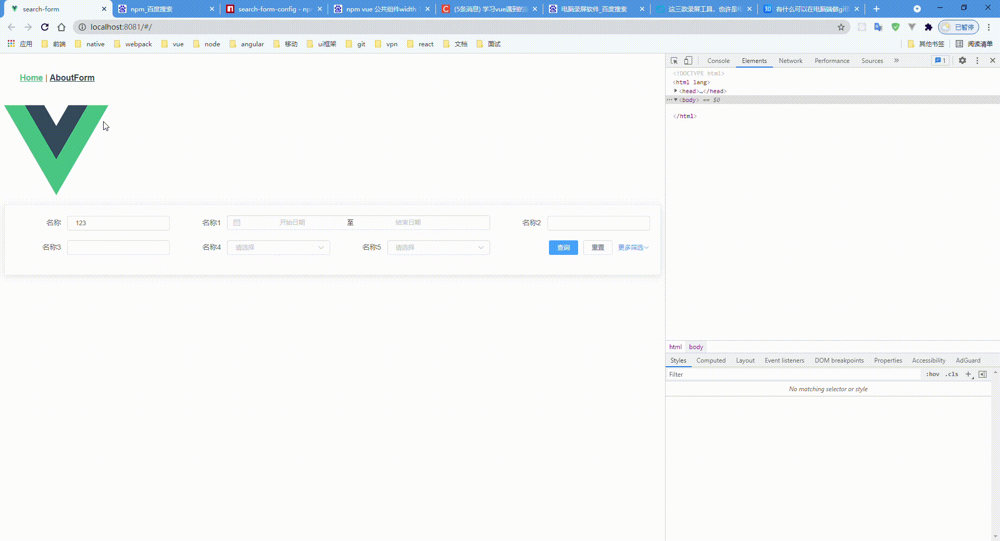

## SearchFormConfig  感觉能用点个星星

1.为了解决后台管理系统搜索条件过多，一屏内表格展示内容过少问题封装了这个动态配置搜索表单内容
### 安装
```html
npm i search-form-config
```
### 使用
在vue main.js
```js
import searchFormConfig from 'search-form-config'
Vue.use(searchFormConfig)


<search-form-config
    :form-item-list="formItemList" // 表单属性配置
    :row="2" // 显示几行
    size="mini"
    label-width="100px"
  />
```

```json
{
  formItemList: [
    {
      type: 'input',
      label: '名称',
      model: 'test',
      initialValue: '123',
    },
    {
      type: 'date',
      label: '名称1',
      model: 'test1',
      initialValue: [],
      attrs: {
        type: 'daterange',
        format: 'yyyy-MM-dd',
        valueFormat: 'yyyy-MM-dd',
      },
      span: 12,
    },
    {
      type: 'date',
      label: '名称2',
      model: 'test2',
      initialValue: '',
      attrs: {
        type: 'year',
        format: 'yyyy',
        placeholder: '年份',
      },
      span: 6,
    },
    {
      type: 'date',
      label: '名称3',
      model: 'test3',
      initialValue: '',
      attrs: {
        type: 'year',
        format: 'yyyy',
        valueFormat: 'yyyy',
      },
      span: 6,
    },
    {
      type: 'select',
      label: '名称4',
      model: 'test4',
      initialValue: [],
      options: [
        {
          label: '测试1',
          value: 'q123',
        },
        {
          label: '测试2',
          value: 'q',
        },
      ],
      span: 6,
    },
    {
      type: 'select',
      label: '名称5',
      model: 'test5',
      initialValue: [],
      options: [],
      span: 6,
    },
    {
      type: 'input',
      label: '名称6',
      model: 'test6',
      span: 6,
    },
    {
      type: 'select',
      label: '名称7',
      model: 'test7',
      initialValue: [],
      options: [
        {
          label: '测试1',
          value: 'q123',
        },
        {
          label: '测试2',
          value: 'q',
        },
      ],
      span: 6,
    },
    {
      type: 'date',
      label: '名称8',
      model: 'test8',
      initialValue: [],
      attrs: {
        type: 'daterange',
        format: 'yyyy-MM-dd',
        valueFormat: 'yyyy-MM-dd',
      },
      span: 12,
    },
    {
      type: 'date',
      label: '名称9',
      model: 'test9',
      initialValue: '',
      attrs: {
        type: 'date',
        format: 'yyyy-MM-dd',
        valueFormat: 'yyyy-MM-dd',
      },
      span: 6,
    },
    {
      type: 'date',
      label: '月份',
      model: 'test10',
      initialValue: '',
      attrs: {
        type: 'month',
        format: 'MM',
        valueFormat: 'MM',
      },
      span: 6,
    },
    {
      type: 'date',
      label: '多天选择',
      model: 'test11',
      initialValue: [],
      attrs: {
        type: 'dates',
        format: 'yyyy-MM-dd',
        valueFormat: 'yyyy-MM-dd',
      },
      span: 6,
    },
    {
      type: 'date', // 时间控件
      label: '周',
      model: 'test12',
      initialValue: '',
      attrs: {
        type: 'week', // 具体的时间控件类型
        format: 'yyyy 第 WW 周',
      },
      span: 6,
    },
    {
      type: 'date',
      label: '时间',
      model: 'test13',
      initialValue: '',
      attrs: {
        type: 'datetime',
        format: 'yyyy-MM-dd hh:mm:ss',
        valueFormat: 'yyyy-MM-dd hh:mm:ss',
      },
      span: 6,
    },
    {
      type: 'date',
      label: '时间范围',
      model: 'test14',
      initialValue: [],
      attrs: {
        type: 'datetimerange',
        format: 'yyyy-MM-dd hh:mm:ss',
        valueFormat: 'yyyy-MM-dd hh:mm:ss',
      },
      span: 12,
    },
    {
      type: 'date',
      label: '时间范围',
      model: 'test15',
      initialValue: [],
      turnKey: true, // 是否需要转换字段
      attrs: {
        type: 'monthrange',
        format: 'yyyy-MM',
        valueFormat: 'yyyy-MM',
        begin: 'beginDate', // 开始时间
        end: 'endDate',  // 结束时间
      },
      span: 12,
    },
  ],
}
```

