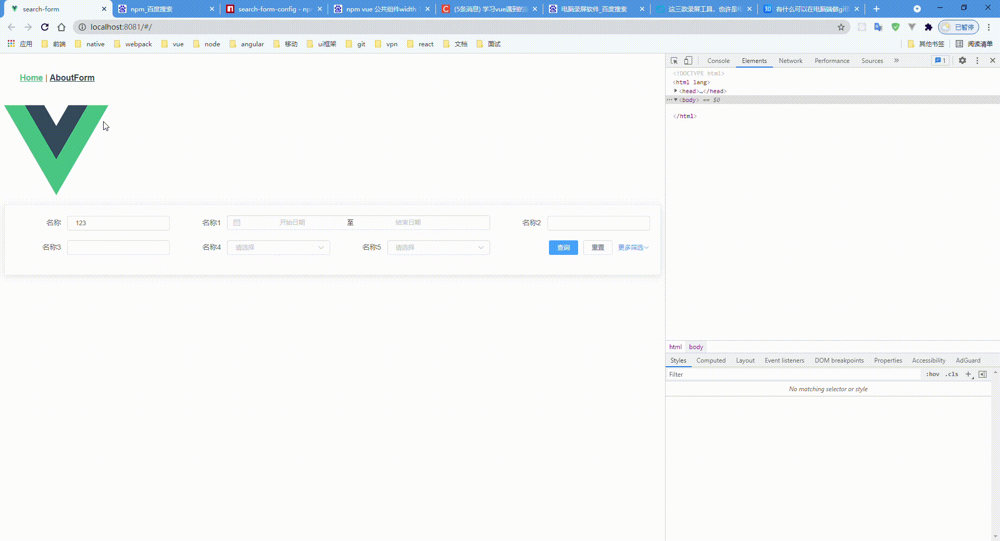

##SearchFormConfig

1.为了解决后台管理系统搜索条件过多，一屏内表格展示内容过少问题封装了这个动态配置搜索表单内容
###安装
```html
npm i search-form-config
```
###使用
在vue main.js
```js
import searchFormConfig from 'search-form-config'
Vue.use(searchFormConfig)


<search-form-config
    :form-item-list="formItemList" // 表单属性配置
    :row="2" // 显示几行
    size="mini"
    label-width="100px"
  />
```


